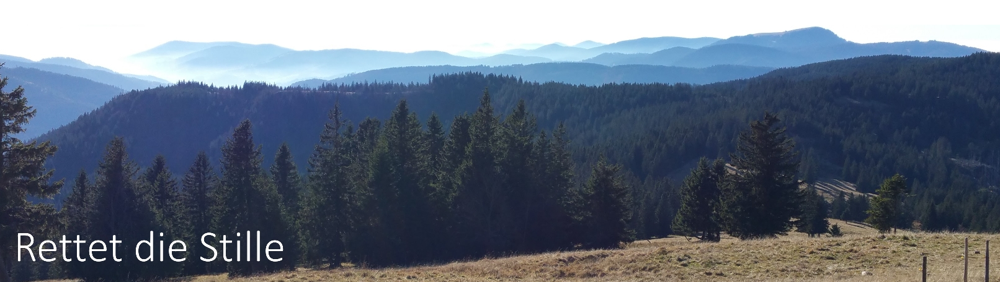

## Es braucht nur wenige Egoisten um ganze Naturregionen oder Erholungsgebiete für Tausende von Menschen zu entwerten. Nämlich dann, wenn sie mit lauten Motorrädern, Quads oder auf Sound getunten Sportwagen in Natur- oder Erholungsgebiete fahren oder diese in niedriger Höhe mit dem Sport- oder Leichtflugzeug überfliegen. Das darf so nicht bleiben!

Wer kenn das nicht: Ein einziger Sportflieger fliegt mit einem Sportflugzeug oder Gyrocopter über ein Erholungs- oder Naturgebiet, tausende Menschen sind genervt und das alles nur, damit 1 oder 2 Leute im Cockpit ihren Spaß haben. Oder Motorradfahrer, die sich nur mit "kerniger" Soundkulisse wohlfühlen und laut knatternd ganze Täler mit einem Lärmteppich übersäen, sodaß die letzten verbliebenden Ruhezonen in der Natur verloren gehen. Nicht viel anders tragen lautstarke Motorboote auf den Seen in ganz Deutschland zur Zerstörung der Stille in der Natur bei. Und das besonders effizient, weil auf dem Wasser der Schall besonders weit trägt.

Die Initiatve "Rettet die Stille" möchte auf den Verlust der Stille aufmerksam machen und versuchen, mehr Menschen für effektiven Lärmschutz zu gewinnen. Und dies nicht durch den Bau von teuren Lärmschutzwänden oder passiven Schallschutz an den Fenstern der Wohnungen, sondern ganz einfach und kostengünstig dadurch, dass die bestehenden Lärmschutzverordnungen grundsätzlich überarbeitet werden. Sie sind löchrig, durch beständige Lobbyarbeit der Fahrzeugindustrie ausgehölt und mittlerweile völlig nutzlos. Die darin enthaltenen Dezibel-Grenzwerte sind viel zu hoch angesetzt. Wer wirklich mal nachmisst, wiel laut Fahrzeuge (und übrigens auch andere technische Anlagen) sein dürfen, bevor ein gGenzwert erreicht wird, der wird sich wundern.

Das hat leider mittlerweile auch die Industrie entdeckt und nutzt bestehende Freiräume gnadenlos aus. Teilweise wird sogar durch technische Maßnahmen dafür gesorgt, dass Fahrzeuge nicht leiser, sondern absichtlich lauter werden. Leider ist die Lobby der Krach-Fetischisten sehr viel besser organisiert (z.B. in Industrie- oder Motorradverbänden) als die Lärm-Leidtragenden. Ein Kampf David gegen Goliath.

Was übrigens - anders als viele denken - keine Lösung ist, ist der Ruf nach mehr Polizeikontrollen. Wer mit Polizisten darüber spricht, der erfährt sehr schnell, dass der Polizei aufgrund der löchrigen Lärmvorschriften die Hände gebunden sind. Viele Fahrzeuge, die der Laie als "manipuliert" empfindet, sind absolut legal. Das ist sehr frustrierend, auch für die Mitarbeiter der Polizeibehörden. 

Eine Änderung der Situation kann nur in der Politik auf Bundes- und EU-Ebene erfolgen. Denn dort werden diese Verordnungen gemacht. Bislang dominiert dort allerdings der Einfluß der Lärmlobby. Vielleicht kann diese Website ein bisschen dazu beitragen, dass sich das ändert. 
